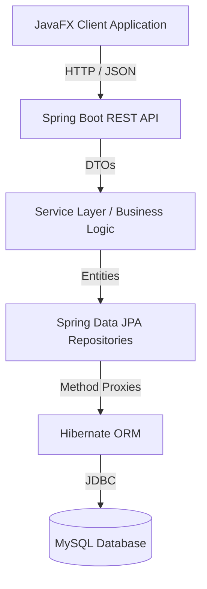

# System Architecture

LicenseGuard is built using a decoupled, multi-tier architecture to ensure strong separation of concerns, high security, and easy testability.

## High-Level Data Flow

## Layer Responsibilities

### 1. Frontend (JavaFX)
- **Role**: Provides the graphical user interface.
- **Responsibility**: Takes user input, makes asynchronous HTTP requests to the backend, and displays the resulting data.
- **Constraint**: It has absolutely **no direct access** to the database (no JDBC). All logic relies purely on API responses. 

### 2. Controller Layer (REST API)
- **Role**: The gateway to the backend.
- **Responsibility**: Receives HTTP requests (GET, POST, PUT, DELETE), parses JSON payloads into Data Transfer Objects (DTOs), validates basic input constraints (`@Valid`), and passes data to the Service layer. It returns structured `ApiResponse` JSON to the client.

### 3. Service Layer (Business Logic)
- **Role**: The brain of the application.
- **Responsibility**: Enforces all business rules (e.g., verifying a license has available seats before assignment). It dictates the logical flow, interacts with multiple repositories, and defines `@Transactional` boundaries so that complex operations either succeed completely or fail safely.

### 4. Repository Layer (Persistence)
- **Role**: The interface to the database.
- **Responsibility**: Uses Spring Data JPA to provide CRUD methods without writing boilerplate SQL. The Service layer calls these interfaces, and Spring generates the necessary proxy classes.

### 5. Hibernate ORM
- **Role**: Object-Relational Mapper.
- **Responsibility**: Translates the Java Entity objects and Spring Data method calls into highly optimized, parameterized MySQL queries.

### 6. Database (MySQL)
- **Role**: The persistent storage.
- **Responsibility**: Stores the normalized relational data securely. Enforces foreign key constraints to ensure referential integrity at the lowest level.
