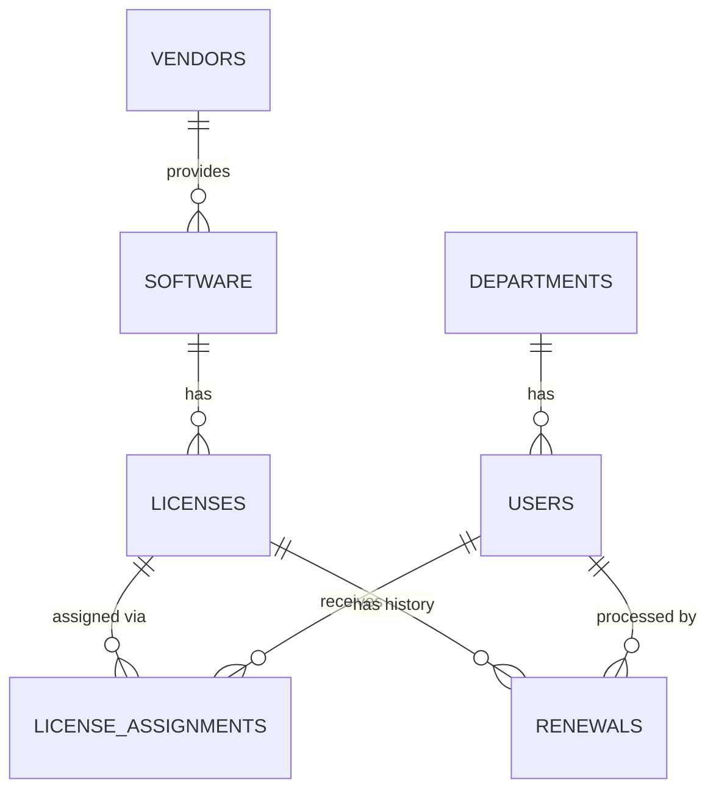

# Database Documentation

This document outlines the relational database schema implemented in LicenseGuard using MySQL.

## Overview
The schema consists of 7 normalized tables.

## 1. `departments`
- **Purpose**: Categorizes users into organizational units.
- **Primary Key**: `department_id` (INT, AUTO_INCREMENT)
- **Columns**:
  - `department_name` (VARCHAR 100, NOT NULL)
  - `description` (VARCHAR 255)
- **Relationships**: 1:N with `users`

## 2. `users`
- **Purpose**: Stores employee and system administrator details.
- **Primary Key**: `user_id` (INT, AUTO_INCREMENT)
- **Columns**:
  - `name` (VARCHAR 100, NOT NULL)
  - `email` (VARCHAR 150, NOT NULL, UNIQUE)
  - `password` (VARCHAR 255, NOT NULL)
  - `role` (VARCHAR 30, NOT NULL)
  - `status` (VARCHAR 20)
- **Foreign Keys**: `department_id` -> `departments(department_id)`
- **Relationships**: N:1 with `departments`, 1:N with `license_assignments`, 1:N with `renewals`

## 3. `vendors`
- **Purpose**: Stores software manufacturer/vendor details.
- **Primary Key**: `vendor_id` (INT, AUTO_INCREMENT)
- **Columns**:
  - `vendor_name` (VARCHAR 100, NOT NULL)
  - `contact_email` (VARCHAR 150)
  - `website` (VARCHAR 255)
- **Relationships**: 1:N with `software`

## 4. `software`
- **Purpose**: Represents software titles managed by the organization.
- **Primary Key**: `software_id` (INT, AUTO_INCREMENT)
- **Columns**:
  - `software_name` (VARCHAR 100, NOT NULL)
  - `version` (VARCHAR 50)
  - `description` (TEXT)
- **Foreign Keys**: `vendor_id` -> `vendors(vendor_id)`
- **Relationships**: N:1 with `vendors`, 1:N with `licenses`

## 5. `licenses`
- **Purpose**: Tracks specific license purchases, types, and overall seat capacity.
- **Primary Key**: `license_id` (INT, AUTO_INCREMENT)
- **Columns**:
  - `license_key` (VARCHAR 255, NOT NULL, UNIQUE)
  - `license_type` (VARCHAR 50, NOT NULL)
  - `purchase_date` (DATE)
  - `start_date` (DATE)
  - `expiry_date` (DATE, NOT NULL)
  - `total_seats` (INT, NOT NULL)
  - `available_seats` (INT, NOT NULL)
  - `cost` (DECIMAL 10,2)
  - `status` (VARCHAR 30)
- **Foreign Keys**: `software_id` -> `software(software_id)`
- **Relationships**: N:1 with `software`, 1:N with `license_assignments`, 1:N with `renewals`

## 6. `license_assignments`
- **Purpose**: Maps a specific license seat to a specific user.
- **Primary Key**: `assignment_id` (INT, AUTO_INCREMENT)
- **Columns**:
  - `assigned_date` (DATE, NOT NULL)
  - `unassigned_date` (DATE)
  - `status` (VARCHAR 30)
- **Foreign Keys**: 
  - `license_id` -> `licenses(license_id)`
  - `user_id` -> `users(user_id)`
- **Relationships**: N:1 with `licenses`, N:1 with `users`

## 7. `renewals`
- **Purpose**: Maintains a historical ledger of license expiration extensions.
- **Primary Key**: `renewal_id` (INT, AUTO_INCREMENT)
- **Columns**:
  - `renewal_date` (DATE, NOT NULL)
  - `old_expiry_date` (DATE, NOT NULL)
  - `new_expiry_date` (DATE, NOT NULL)
  - `renewal_cost` (DECIMAL 10,2)
  - `remarks` (VARCHAR 255)
- **Foreign Keys**: 
  - `license_id` -> `licenses(license_id)`
  - `renewed_by` -> `users(user_id)`
- **Relationships**: N:1 with `licenses`, N:1 with `users`
