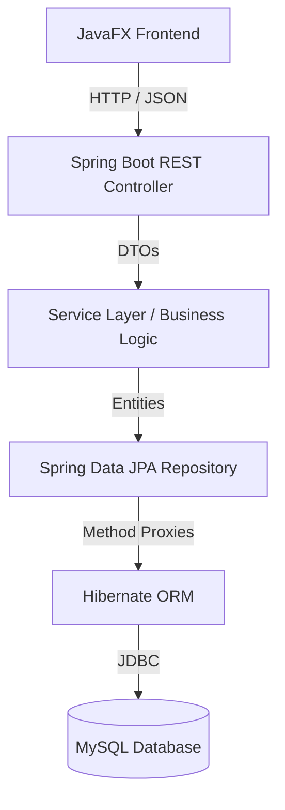
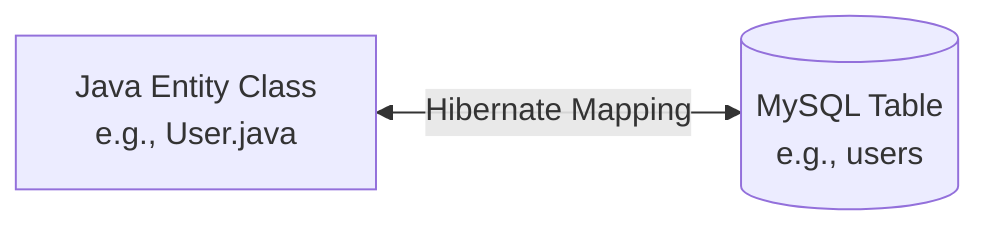

# Hibernate / JPA Documentation

This document explains the final, verified implementation of Hibernate and Spring Data JPA within the **LicenseGuard** project.

---

## 1. What is Hibernate?
Hibernate is an Object-Relational Mapping (ORM) framework for Java. It maps Java classes (Entities) to database tables, and Java data types to SQL data types, relieving the developer from writing manual SQL queries for typical CRUD (Create, Read, Update, Delete) operations.

## 2. JPA vs Hibernate
- **JPA (Java Persistence API)**: A specification/standard in Java for managing relational data. It dictates *how* ORM should behave using annotations like `@Entity`, `@Id`, etc.
- **Hibernate**: The actual implementation of the JPA specification. While JPA provides the rules, Hibernate does the heavy lifting of connecting to MySQL and generating the SQL queries.

## 3. Why Hibernate is used in LicenseGuard
LicenseGuard is a complex business application dealing with deeply related records (Departments -> Users -> Licenses). Using raw JDBC/SQL would require thousands of lines of boilerplate code to handle joins, updates, and cascading operations. Hibernate ensures:
1. **Type Safety**: Queries are built against Java classes instead of raw strings.
2. **Transaction Management**: Multi-step business logic (like updating a license seat count and inserting an assignment) happens atomically.
3. **Database Independence**: The Java code doesn't rely on MySQL-specific syntax, allowing for easy testing and portability.

## 4. LicenseGuard Hibernate Architecture



### Entity Mapping Flow


---

## 5. Entity List & 6. Entity-to-Table Mapping

| Java Entity | MySQL Table | Primary Key | Main Relationships |
|-------------|-------------|-------------|--------------------|
| `Department` | `departments` | `department_id` | 1:N with `User` |
| `User` | `users` | `user_id` | N:1 with `Department`, 1:N with `LicenseAssignment`, 1:N with `Renewal` |
| `Vendor` | `vendors` | `vendor_id` | 1:N with `Software` |
| `Software` | `software` | `software_id` | N:1 with `Vendor`, 1:N with `License` |
| `License` | `licenses` | `license_id` | N:1 with `Software`, 1:N with `LicenseAssignment`, 1:N with `Renewal` |
| `LicenseAssignment` | `license_assignments` | `assignment_id` | N:1 with `License`, N:1 with `User` |
| `Renewal` | `renewals` | `renewal_id` | N:1 with `License`, N:1 with `User` |

---

## 7. Core Hibernate Annotations Used

### `@Entity` & `@Table`
Flags a Java class as a persistent database object and binds it to a specific MySQL table.
```java
@Entity
@Table(name = "licenses")
public class License { ... }
```

### `@Id` & `@GeneratedValue`
Defines the primary key and specifies that MySQL will auto-increment it.
```java
@Id
@GeneratedValue(strategy = GenerationType.IDENTITY)
@Column(name = "license_id")
private Integer licenseId;
```

### `@Column`
Maps a Java field to a specific MySQL column, defining constraints like length, nullability, and precision.
```java
@Column(name = "license_key", length = 255, nullable = false, unique = true)
private String licenseKey;
```

---

## 8. Relationship Mapping

### `@ManyToOne` & `@JoinColumn`
Used on the "Many" side of a relationship to define the foreign key column.
```java
@ManyToOne(fetch = FetchType.LAZY)
@JoinColumn(name = "software_id", nullable = false, foreignKey = @ForeignKey(name = "fk_license_software"))
private Software software;
```

### `@OneToMany` & `mappedBy`
Used on the "One" side of a relationship for bidirectional navigation. The `mappedBy` attribute tells Hibernate that the relationship is already managed by the other side, preventing redundant foreign key creation.
```java
@OneToMany(mappedBy = "software", fetch = FetchType.LAZY)
@JsonIgnore
private List<License> licenses = new ArrayList<>();
```

---

## 9. FetchType.LAZY
By default, LicenseGuard uses `FetchType.LAZY` for all relational mappings.
- **Why?** If we load a `Department`, we don't necessarily want Hibernate to instantly query and load all 5,000 `Users` in that department unless we explicitly ask for them. This prevents the "N+1 query problem" and massive memory spikes.

## 10. `@JsonIgnore` and Serialization Protection
Because we have bidirectional relationships (e.g., `User` has `LicenseAssignments` and `LicenseAssignment` has a `User`), returning these entities directly from a REST API would cause an infinite recursive JSON loop (User -> Assignment -> User -> Assignment...).
- **Solution**: The `@JsonIgnore` annotation is placed on the `@OneToMany` collections. The backend serializes the parent entity cleanly, and specific DTOs (Data Transfer Objects) are used in the Service Layer to flatten relationship data for the frontend.

---

## 11. Spring Data JPA Repositories
Instead of writing manual Hibernate Sessions and Criteria queries, LicenseGuard uses Spring Data JPA interfaces. By simply declaring methods, Spring automatically generates the exact Hibernate SQL:
```java
@Repository
public interface LicenseRepository extends JpaRepository<License, Integer> {
    List<License> findBySoftwareSoftwareId(Integer softwareId);
    boolean existsByLicenseKey(String licenseKey);
}
```

## 12. Hibernate CRUD Flow
1. **Create**: `repository.save(entity)` (Translates to `INSERT INTO...`)
2. **Read**: `repository.findById(id)` (Translates to `SELECT * FROM...`)
3. **Update**: Handled dynamically. If a fetched entity's fields are modified inside a `@Transactional` method, Hibernate's "Dirty Checking" mechanism automatically issues an `UPDATE` statement when the transaction commits.
4. **Delete**: `repository.delete(entity)` (Translates to `DELETE FROM...`)

---

## 13. Hibernate Transaction Handling
The `@Transactional` annotation guarantees ACID (Atomicity, Consistency, Isolation, Durability) properties for complex business rules.

### Assignment Transaction Example
In `LicenseAssignmentServiceImpl.java`:
```java
@Transactional
public LicenseAssignmentResponse assignLicense(LicenseAssignmentRequest request) {
    // 1. Fetch User and License
    // 2. Decrease available seats on License
    license.setAvailableSeats(license.getAvailableSeats() - 1);
    licenseRepository.save(license); // (Stored in 1st level cache)

    // 3. Create Assignment record
    LicenseAssignment assignment = new LicenseAssignment();
    // ...
    assignmentRepository.save(assignment); 
    
    // -> Transaction Commits: Both UPDATE and INSERT are flushed to MySQL simultaneously.
    // If anything fails, EVERYTHING rolls back automatically.
}
```

---

## 14. Hibernate and Business Logic Separation
LicenseGuard strictly enforces that **Hibernate handles persistence, but the Service Layer handles business rules**.
- We do not rely on database constraints alone to throw raw SQL errors.
- The Service layer actively queries Hibernate (`existsBy...`) and throws custom Java exceptions (`DuplicateResourceException`, `BadRequestException`) which the GlobalExceptionHandler translates into clean HTTP API responses.

## 15. Hibernate and MySQL (ddl-auto)
In `application.properties`:
```properties
spring.jpa.hibernate.ddl-auto=validate
```
**Critical Security/Stability Rule**: We strictly use `validate`. Hibernate connects to MySQL on startup, reads the existing schema, and compares it to the Java `@Entity` classes. If there is a mismatch (e.g., missing column), the backend fails to start.
- We **do not** use `update` or `create-drop` in production to prevent Hibernate from accidentally dropping tables or altering the schema arbitrarily.
